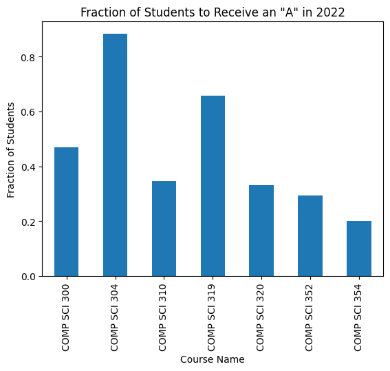
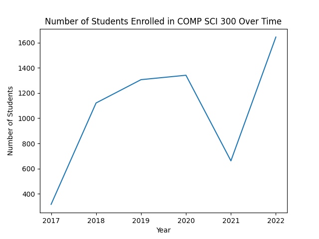
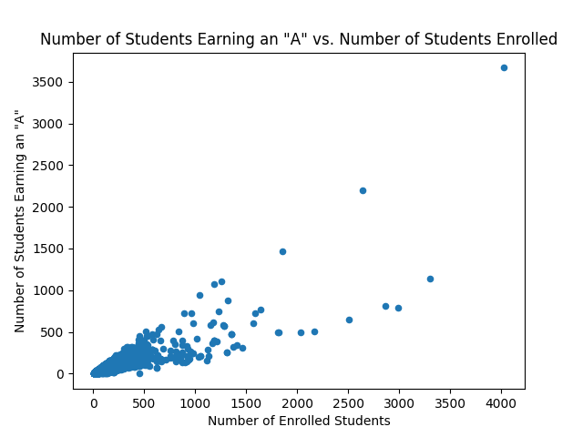

# Machine Project 1: Review

## Corrections and Clarifications

* None yet

## Overview

This machine project focuses on review of concepts needed to succeed in this course; it is
designed to get familiar with Python basics (or review them if you
took 220).

### Learning Objectives

During this machine project, students will:
- Write code to control the flow of execution using loops, functions, and if statements.
- Extract values from Python state (variables, data structures, etc.) including nested lists and dictionaries.
- Use the `pandas` package to read CSV files into DataFrames and analyze and plot the resulting data.

## Setup

Make sure to complete [Lab 1](../labs/Lab1/README.md) before starting this, as it must be done on your
virtual machine.

1. SSH to your virtual machine by running `ssh USERNAME@IP_ADDRESS`

If you don't recall these from lab, you can find your [username](https://console.cloud.google.com/compute/metadata/sshKeys)
and [External IP address](https://console.cloud.google.com/compute/instances) in Google's
console.

2. Run `pip3 install pandas matplotlib`

3. Please refer to the [git-workflows](../git-workflows/README.md/#getting-started-with-your-vm) for how to clone your personal GitLab repository. 

4. Go to `http://YOUR_IP_ADDRESS:2020/` in the browser (sign in, if prompted)

Jupyter should still be running from when you started it during lab, but if it's not, you can start it again with the following:

`nohup python3 -m jupyterlab --no-browser --ip=0.0.0.0 --port=2020 &`

1. **Follow the "starting a machine project" instructions in the [git-workflows](../git-workflows/README.md/#starting-a-machine-project)
document to make sure that you are on the right branch and have the right files.**

2. Enter the `mp1` directory (expand the folder icon on the left of the screen if you don't see these directories)

3. Click to create a new `Python 3 (ipykernel)` notebook

4. Go to "File" > "Rename Notebook", and name your notebook "mp1.ipynb"

**Note:** some browsers have a "dark mode" -- be careful not to use it when looking at plot examples (it often hides axis labels in the examples, which you need for full credit).

## Testing

Your notebook should follow this format to be compatible with the tester:

```python
# import statements in the top cell
```

```python
#Q1
some code
output answer
```

```python
#Q2
some code
output answer
```

For example, if question 0 was "What is 10 - 3?", our cell would look like this:

```python
#Q0
answer = 10 - 3
answer # Notice that we just put the variable name -- don't print it or you will get an error
```

To test your answers, do the following:
1. Do a "Kernel" > "Restart Kernel & Run All Cells" in your notebook
2. "File" > "Save Notebook"
3. In terminal, navigate to your machine project 1 directory
4. Run `python3 tester.py mp0.ipynb` and work on fixing any issues

**Notes**: 
* ***Do not*** include the question, or anything else after "#Q__" or else we may be unable to
parse your notebook.
* It is okay to include additional cells outside of these, but only questions that have "#Q__" as
the first line will be graded.
* You need to do a "Restart Kernel & Run All Cells" each time you make modifications to your
notebook. Wait for all cells to run before saving. If you get an error that says "Expected
execution count XX but found YY", you need to do this again.

## Submission

**Required Files**
* `mp1.ipynb`: A notebook that should contain all of your answers to the machine project questions below.

To submit the machine project, make sure that you have followed the instructions for "submitting a machine project"
in the [git-workflows](../git-workflows/README.md/#submitting-a-machine-project) document for the required file(s) above.

When following the submission instructions from above, the final output should look similar to this in GitLab:


If you do not know how to get to this screen, review the link above. If you are having issues, please come to office hours.

### Important Notes:
1. This whole assignment is to be done **individually**. That means, you are only allowed to seek help from CS 320 course staff (peer mentors, TAs, and the instructor). You may not receive help from anyone else.
2. Hardcoding of any kind or trying to "cheat" the autograder **will be penalized heavily and can also result in 0 marks for all the projects**. If you are confused about your code, please reach out to the teaching staff before submission.


## Part 1: Python Control Flow

For part 1, you will focus on how to implement logic in Python and alter the control flow 
of code. This will mean working with if/elif/else-statements, while/for loops, creating and using functions, and using some built-in Python functions.

### Q1: What is the type of `11/7`?
Python offers many built-in functions that we will use throughout the course of this semester. Look at a list of them here to see which one can help you answer this question: https://docs.python.org/3/library/functions.html.

11 and 7 are ints, and so in most programming languages, dividing two ints will result in an int as well (1 after rounding down from 1.57). However, in Python, we get the mathematically correct answer of 1.57...

If we wanted to instead get an int from our division, we can use `//` instead of `/`. Try it out with `11/7` and `11//7` in jupyter.

### Q2: Is the length of `fruit_list` between 2 and 5?

Complete the code in accordance with the comment to get the correct answer. It may be helpful to review the [Python built-in functions](https://docs.python.org/3/library/functions.html) in Q1.

```python
fruit_list = ["apple", "pear", "banana", "watermelon"]
fruit_list_length = ???? # Don't hardcode this. Use a Python built-in

minimum = 2
maximum = 5
in_range = ???? # True if the number of fruits in fruit_list is inside the minimum-to-maximum range
in_range
```

**Notes**:
1. We don't need to specify the type of our variables as in some languages (e.g., Java) -- Python knows `x` is an `int` because we assigned `4`, which is an int. Variable types are not fixed after creation as in some languages (e.g., Go) -- we could later run `x = "howdy"` if we wanted to.
2. In Python, a `bool` is `True` or `False`. We use the `and`, `or`, and `not` operators to operate on `bool`s. In other programming languages, these operators are often expressed as `&&`, `||`, and `!` respectively.

### Q3: Ignoring case, how many of the files in `filepaths` end in `.csv`?

Complete the code below for your answer:

```python
filepaths = "TESTING_FILE1.C5V-TESTING_FILE2.CSV-TESTING_FILE3.CSV"
file_list = ????
csv_count = 0
for file in file_list:
    if ????:
        csv_count += 1
csv_count
```

**Hints**:
1. Consider starting by splitting the string into a list of strings. Notice that they are all separated by `-`. 
2. To ignore case, it's often easy to use a string method to make everything uppercase or lowercase.
3. To get a single character from a string `s`, you can use `s[INDEX]`. 0 is the first character, 1 is the second, and so on. Python supports negative indexing, meaning `s[-1]` is the last letter, `s[-2]` is the next to last, etc. You can also slice strings to get a substring by putting a colon between two indexes `s[inclusive_start:exclusive_end]`. You can leave off one of the indexes to go to the start or end of the string. For example, `filepath[:7]` would evaluate to `"TESTING"`.
4. In Java, you compare strings with `s1.equals(s2)`, but in Python the correct equivalent is `s1 == s2`. The equivalent of Java's `==` is Python's rarely used `is` operator.

In addition to built-ins, Python defines several methods for specific objects like strings. Skim the string methods here: https://docs.python.org/3/library/stdtypes.html#string-methods. Some important ones: `find`, `isdigit`, `join`, `split`, `lower`, `upper`, `strip`, `replace`.

### Requirement: `multiply` function

In a new cell, you will define a new function: `multiply(...)`.Your function will take two ints and return their product. For example, `multiply(2, 3)` should return 6. Users of this function should also be able to call it like `multiply(a=2, b=3)`. If only one argument is passed, the value should be multiplied by 2. For example, `multiply(4)` or `multiply(a=4)` should both return 8.

Python parameters may be filled with positions arguments, keyword arguments, or default arguments.  If this is unfamiliar, read the following:

1. https://docs.python.org/3/tutorial/controlflow.html#defining-functions
2. https://docs.python.org/3/tutorial/controlflow.html#more-on-defining-functions

In Python, indents are very important.  The code inside a function/if/loop is indented (Python doesn't use `{` and `{` to indicate this, as in Java and many other languages).

### Q4. What is `multiply(5)`?

### Requirement: `smart_multiply` function

In Python, lists can be created like `[item1, item2, item3, ...]` and can be indexed/sliced just like strings (strings and lists are both examples of Python *sequences*; by definition, you can index and slice any kind of sequence you encounter in Python).  This list contains just ints, but you're free to have a mix of types in Python lists.

In general, you can plug in a variable name and sequence into a `for` loop to run a piece of code for every entry in the sequence:

```python
for ???? in ????:
    # DO SOMETHING
```

More on `for` loops:
* https://docs.python.org/3/tutorial/controlflow.html#for-statements
* https://docs.python.org/3/tutorial/controlflow.html#break-and-continue-statements-and-else-clauses-on-loops

Write a function called `smart_multiply` that takes a list of numbers and returns their product. It should have the following features:
1. Ignore numbers that are negative or zero.
2. Once the product is above 100 (strictly larger than 100), all of the numbers that follow it, positive or negative, should be skipped.

Use `continue` to implement feature 1 and `break` to implement feature 2.

### Q5. What is `smart_multiply([4, -2, 0, 5, 5, 2, 7, -2])`

The answer should be 200. We should skip -2, 0, and -2 since they are less than or equal to 0. Additionally, 4 * 5 * 5 = 100, which is **not** strictly greater than 100, so we need to multiply by 2 to get 200 and then we skip 7 since 200 > 100.

## Part 2: Interacting with Python State

For part 2, you will focus on how to interact with python objects, especially those that are nested (i.e. list inside of a list, dict inside of list, etc.). We will look at how to
modify state, as well as how to extract state, and make copies of state that copy
data structures on different levels of depth.

### Requirement: lists and dicts:

Copy/paste the following:

```python
header = ["A", "B", "C"]

coord1 = {"x": 8, "y": 5}
coord2 = {"x": 9, "y": 2, "z" : 4}
coord3 = {"x": 3, "y": 1, "z" : 7}

rows = [
    [1, 6, 7, 8, coord1],
    [3, 4, 9, coord2],
    [5, 2, coord3],
]
```

Note that `rows` is a list of lists.  Each inner list contains some number of ints and one dict (dictionary).  For complicated nested structures like this, it's often helpful to visualize the stack of frames and heap of objects in PythonTutor: https://pythontutor.com/live.html#mode=edit.

You could copy the above to visualize it, or use the following link for your convenience:

https://pythontutor.com/visualize.html#code=header%20%3D%20%5B%22A%22,%20%22B%22,%20%22C%22%5D%0A%0Acoord1%20%3D%20%7B%22x%22%3A%208,%20%22y%22%3A%205%7D%0Acoord2%20%3D%20%7B%22x%22%3A%209,%20%22y%22%3A%202%7D%0Acoord3%20%3D%20%7B%22x%22%3A%203,%20%22y%22%3A%201%7D%0A%0Arows%20%3D%20%5B%0A%20%20%20%20%5B1,%206,%20coord1%5D,%0A%20%20%20%20%5B3,%204,%20coord2%5D,%0A%20%20%20%20%5B5,%202,%20coord3%5D,%0A%5D&cumulative=false&curInstr=7&heapPrimitives=nevernest&mode=display&origin=opt-frontend.js&py=3&rawInputLstJSON=%5B%5D&textReferences=false

Both lists and dicts contain values.  With lists, each value is associated with an index (integers starting from 0).  With dicts, each value is associated with a key specified by the programmers.  Keys are often strings, but they don't need to be.

Docs:
* https://docs.python.org/3/tutorial/datastructures.html#more-on-lists
* https://docs.python.org/3/tutorial/datastructures.html#dictionaries

**Testing Note:** try running `{"A":1, "B":2} == {"B":2, "A":1}` in Python. Note that these two dicts are considered equivalent since they have the same values corresponding to the same keys.  So if the tester complains about any of your dicts (or sets) being wrong, the issue is with the contents, not the order.

### Q6: After inserting a "z" key in `coord1` (with `coord1["z"] = 6`), what is `rows`?

### Q7: What is the value associated with the "y" key of the dict in the last position of the last list in `rows`?

**Hint:** For navigating nested structures, use list indices and dictionary keys to access deeper elements. For example, to access the "z" key of the dictionary in the second list in `rows`, you would use `rows[1][-1]["z"]`. This is because `rows[1]` gives us the second list in `rows` (`[3, 4, 9, {"x": 9, "y": 2, "z" : 4}]`), `rows[1][-1]` gives us the last element of the second list in `rows` (`{"x": 9, "y": 2, "z" : 4}`), and then `rows[1][-1]["z"]` extracts the value for the "z" key in that dictionary.

### Q8: What is `rows` after running the following?

Complete the following so that the first change via `v2` is NOT reflected in `rows`, but the second change via `v2` IS reflected in `rows`:

```python
import copy
v2 = ????
v2[0] = 404    # first change
v2[1][1] = 404 # second change
```

Relevant docs: https://docs.python.org/3/library/copy.html

To get a good intuition about the reference/shallow/deep copy, try stepping through the following slowly in PythonTutor:

```python
import copy
v1 = [[1], [], [2, 3]]
v2 = v1
v2 = copy.copy(v1)
v2 = copy.deepcopy(v1)
```

### Q9: If we imagine the list of lists structure referenced by `rows` as a table, with column names in `header`, what is the sum of values in the "A" column?

Note: the "A" column corresponds to the values at index in 0 of each list, but you are not allowed to hardcode 0 for this solution.  Instead, use `header.index(????)` to look up the position of "A" within the `header` list.

### Q10: What is `rows` after we sort it in-place by the "B" column, descending?

Docs:
* https://docs.python.org/3/howto/sorting.html#sorting-basics
* https://docs.python.org/3/howto/sorting.html#key-functions

Hint: if we had to sort by the "A" column **ascending**, we could do the following:

```python
def get_column_a(row):
    print("lookup A column for a row")
    return row[header.index("A")]

rows.sort(key=get_column_a, reverse=False)
rows
```

Note that we aren't calling `get_column_a` ourselves (because there are no parentheses after it on the sort line).  Instead, we're giving the `sort` method a reference to that function; this allows `sort` to call the function on each row, to figure out what part of the row objects matters for the sort.

When we only need a function for one purpose, we can use the `lambda` syntax instead of the `def` syntax to define the function on a single line, without even giving it a name.  The following works the same as the earlier example (but without the print):

```python
rows.sort(key=lambda row: row[header.index("A")], reverse=False)
rows
```

### Q11: Say you're going on vacation to Canada with 400 US dollars; how many Canadian dollars can you get at the current exchange rate?

This site provides exchange rate information in JSON format: https://www.floatrates.com/json-feeds.html.  JSON is a simple format that can represent nested dicts and lists in files and web resources.

Download a copy of `usd.json` to the directory where your machine project is.  An easy way is to open a terminal, `cd` to the appropriate directory, then run `wget SOME_URL_HERE` to download the web resource.

Note: you can run shell commands in Jupyter, too, if you start the command with a `!` (to indicate it is not Python code).  If you do this, be sure to delete the cell after the download.  Otherwise you'll create too much traffic on the floatrates.com site, re-downloading the same thing every time you re-run your notebook.

You can read a file like this:

```python
f = open("usd.json")
data = f.read()
f.close()
```

Check the type of `data` and the first portion of it:

```python
print(type(data))
print(data[:300] + "...")
```

Even though the file contains a string that *could* be interpreted as JSON, Python won't *deserialize* it to Python dicts/lists automatically.  Instead of calling `.read()`, we need to use the `load` function in the `json` module:

https://docs.python.org/3/library/json.html#json.load

When reading documentation, start by focusing on parameters that can't take default arguments.

Access the exchange rate for Canadian dollars in the dictionary (key is "cad") and multiply it by the amount of US dollars you have to find out how many Canadian dollars you can get. You can round to the nearest 0.01 dollar (1 cent).

**Important**: Note the difference between `json.load()` and `json.loads()`. The first loads json data from a file, whereas the second loads json data from a Python string.

**Important**: Note the difference between `json.dump()` and `json.dumps()`. `json.dump()` serializes a Python object and writes it directly to a file-like object, on the other hand `json.dumps()` serializes a Python object and returns it as a JSON-formatted string.

*Note*: Since the exchange rate is constantly changing, your answer may not be the exact same as is in the answer key. We have implemented a buffer to allow a range of values which should include the correct answer, given the current exchange rate.

### Requirement: `convert_to_int` function:

In Python, we can cast strings that have an integer value into an int using `int(value)`. For example, `int("42")` will return `42` as an int and not a string.

Write a function named `convert_to_int` that will attempt to convert its input into an integer. Note that we will test it with invalid strings (e.g. `"not a number"`, `"forty-two"`) so your function should catch these errors, print `"Could not convert string to int."` and return `None`. For any other exceptions, your function should print `"Error with your input argument."` and return `None`.

How to catch exceptions: https://docs.python.org/3/tutorial/errors.html#handling-exceptions.

**Hints**:
1. To find out what exception to print `"Could not convert string to int."` for, you could try running `int("forty-two")` in a new cell.
2. You can catch specific exceptions like this: `except EXCEPTION_TYPE:`, but you can also catch all exceptions using just `except:`.
3. Make sure you pay attention to the order of your `except` blocks.

### Q12: What is `convert_to_int("320")`?

### Q13: What is `convert_to_int("ninety-nine")`?

*Note*: You may be able to pass the auto-grader with faulty code, as the auto-grader can not check print outputs. This grade will be part of the [manual grading process](./grading-guidelines.md).

### Q14: What is `convert_to_int([3, 2, 0])`?

## Part 3: Data Science using `pandas`

Each year, the University of Wisconsin's Office of the Registrar reports on the grades of students at the university in almost all classes. Unfortunately for us, this data is reported in a PDF format, which isn't super handy for data analysis in Python. You can view these reports here: https://registrar.wisc.edu/grade-reports/.

Fortunately, while creating the grade distribution visualization tool [Madgrades](https://madgrades.com/), former UW Badger Keenan Thompson created an [open-source tool for extracting the data](https://github.com/Madgrades/madgrades-extractor) in these PDFs into SQL and CSV files. We have done some basic manipulation of this data and provided a year-by-year breakdown of it in the `grade-data` directory for the years 2017 - 2022.

Create a dictionary called `grades` like this:

* **Key**: A year (`int`), corresponding to a year of data in the `grade-data` directory. Don't hardcode the years -- use `os.listdir` and extract the year from each filename (right after the last `-`). Check if the file is a CSV by checking if it ends with ".csv". Don't hardcode the years in the dictionary - use the year extracted from the file name as the key.
* **Value**: A pandas DataFrame corresponding to the CSV for that year. Use `set_index` (https://pandas.pydata.org/docs/reference/api/pandas.DataFrame.set_index.html) to make `"course"` the index of the DataFrame.  This will let you easily look up course stats by name (instead of by row number) later.

### Q15: What are the keys in `grades`?

Answer with a sorted list in ascending order.

### Q16: What was the average GPA for COMP SCI 320 in 2022?

The answer is in the column with name `"gpa"` and row with course `"COMP SCI 320"`.  The hardcoding way to answer (not allowed) would be something like:

```python
df_2022 = grades[2022]
df_2022.iat[1228, 6] # iat works like df_2022.iloc[, 6], but is faster for one cell
```

Instead of hardcoding 1228 and 6, you can use "COMP SCI 320" (row index name) and "gpa" (column name).  When using names instead of positions, you just need to use `.at` or `.loc` (instead of `.iat` or `.iloc`).

### Q17: How many computer sciences classes were offered in 2022?

If we wanted a DataFrame of all of the psychology courses in 2016, we could do the following:

```python
df_2016 = grades[2016]
df_2016.loc[df_2016["course_subject"] == "Psychology"]
```

**Note**: The `course_subject` for computer sciences classes is `"Computer Sciences"`. Alternatively, you could look them up using the `course_abbr` of `"COMP SCI"`. Consider saving this filtered DataFrame as a new variable for use in the next questions.

### Q18: How many students received an "A" in computer sciences courses in 2022?

The data will be found in the column `"a_count"`.

If `df` is a DataFrame, `df["some column name here"]` will extract an individual column as a Pandas Series.  A Pandas Series is like a list/dict hybrid.  You can use `.iat` to look up values by integer position (like you would with a list).  You can use `.at` to look up values by the Series' index, like you would with a dict.  Note the confusing terminology here: a Series' index is like a dict's key, and the "i" in "iat" does NOT refer to "index".

If you have a Pandas Series `s`, you can do various aggregations on it, like `.mean()`, `.sum()`, `.max()`, etc.

### Q19: Calculate the fraction of students who received an "A" in each computer sciences class in 2022. Then return the smallest value from this computation.

The total number of students to take a course is stored in the `"total"` column.

You can divide one Pandas Series by another on an element-wise basis like this: `s3 = s2 / s1`.  You can then compute `s3.min()`.  Or better, see if you can combine everything into a one-line computation.

### Q20: What fraction of students in computer sciences courses numbered 300 to 399 received an "A" in 2022?

Use the `"course_num"` column to filter based on the course numbers.

We can also look for multiple criterion using similar syntax. For example, if we wanted all Psychology courses or Biology courses from 2016, we could do the following:

```python
df_2016.loc[(df_2016["subject_name"] == "Psychology") | (df_2016["subject_name"] == "Biology")]
```

In this example, we need to use the `|` instead of `or`. If we wanted to look for all Psychology courses with a GPA of over 3.7, the following would work:

```python
df_2016.loc[(df_2016["subject_name"] == "Psychology") & (df_2016["gpa"] > 3.7)]
```

Answer with a `dict`, where the key is the course's name, and the value is the percentage of students that recieved an "A" in that course i.e. "0.01" for "1%". The resulting dictionary should look like this:

```python
{'COMP SCI 300': 0.4683698296836983,
 'COMP SCI 304': 0.8835616438356164,
 'COMP SCI 310': 0.345679012345679,
 'COMP SCI 319': 0.6567164179104478,
 'COMP SCI 320': 0.33044554455445546,
 'COMP SCI 352': 0.29277566539923955,
 'COMP SCI 354': 0.20095238095238097}
```

**Hint**: Consider using Pandas `to_dict()` function to convert a Series to a Python dictionary

### Q21: Same question as Q20, but answer with a bar plot instead of a `dict`.

If you have a Series `s`, you can use `s.plot.bar()` or `s.plot.barh()`.  The labels of the x-axis and y-axis should be as shown in the below graph, as also seen (here)[./grading-guidelines.md]

Example:



### Q22: How has the number of students taking COMP SCI 300 changed over recent years?

Answer with a plot like this: The labels of x-axis and y-axis should be as shown in the below graph.



### Q23: What is the relationship between number of students who receive an "A" and GPA of a course for 2022?

Answer with a plot where the x-axis is the total number of sutdents enrolled in a course and the y-axis is the number of students that earned an "A" in that course. The labels of x-axis and y-axis should be as shown in the below graph.

