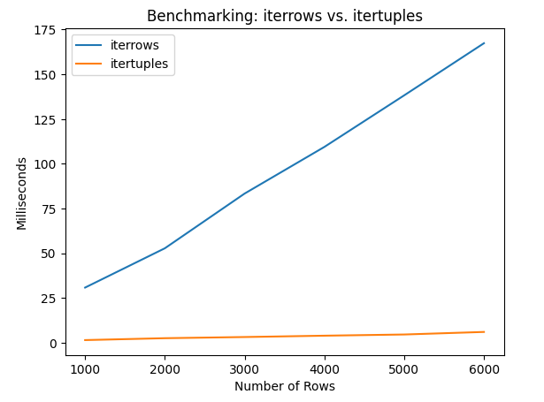
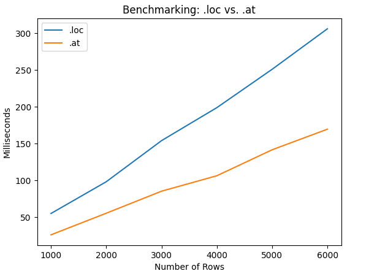
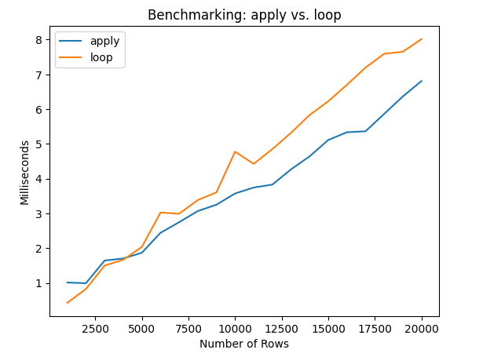

# Machine Project 2: Webscraping & Data Analysis, Git Analysis, and Benchmarking

## Corrections and Clarifications

* None yet

## Overview

This machine project will help studens review some basic HTML concepts from CS 220, check their understanding of the structure of Git repositories, and perform simple benchmarking analysis to compare and measure the performance of code.

### Learning Objectives

During this machine project, students will:
- Review some basic webscraping concepts and analyze the gathered data
- Write code to analyze the history of a git project.
- Measure performance of different functions by benchmarking.

## Setup

Before you begin, follow the "starting a machine project" instructions in the [git-workflows](../git-workflows/README.md/#starting-a-machine-project) document to make sure that you are on the right branch and have the right files.

Since it is still early in the semester, we have provided the commands for you to run below:

```
git checkout main # Switch to the main branch
git pull # Pull the remote changes to your local branch
git checkout MP2 # Switch to the MP2 branch
git merge main # Merge the changes from main into MP2
```

Once you run these commands, you should verify that you are on the `MP2` branch by running `git branch`. Additionally, when you are in your git directory for this class, you should be able to run `ls` to see that this machine project and all of its files are present.

You are now ready to begin the machine project. Make sure that you add-commit-push your code as you go.

## Submission

**Required Files**
* `mp2.ipynb`: A notebook that should contain all of your answers to the machine project questions below.

To submit the machine project, make sure that you have followed the instructions for "submitting a machine project"
in the [git-workflows](../git-workflows/README.md/#submitting-a-machine-project) document for the required file(s) above.

When following the submission instructions from above, the final output should look similar to this in GitLab:


If you do not know how to get to this screen, review the link above. If you are having issues, please come to office hours.

### Important Notes:
1. This whole assignment is to be done **individually**. That means, you are only allowed to seek help from CS 320 course staff (peer mentors, TAs, and the instructor). You may not receive help from anyone else.
2. Hardcoding of any kind or trying to "cheat" the autograder **will be penalized heavily and can also result in 0 marks for all the projects**. If you are confused about your code, please reach out to the teaching staff before submission.

## Part 1: HTML Review

This first part of the project will serve as a review of some basic HTML and webscraping concepts.

### Q1: What is the email listed under the contact information in `sample.html`?

Your output must be a **string** representing the email listed under the "Contact Section" of `sample.html`. 

**Hint:** Consider opening the HTML file and looking at it to get familiar with its structure. 

**Hint:** Begin by opening `sample.html`, then use `beautifulsoup4` to parse the html content and find the email. Use `find` to locate the "Contact Section" and find the email.

**Note:** You must **not** hardcode the solution

### Requirement: Rankings DataFrame

For the next few questions, you'll be tasked with analyzing and extracting world university rankings from a pre-saved HTML file, `rankings.html`, adapted from the [CWUR rankings](https://cwur.org/2020-21.php). To ensure efficiency and avoid overloading the original webpage with multiple requests, we've provided a local copy for all students. The goal of this first part is to parse the provided HTML file to collect and analyze data. 


Use BeautifulSoup to parse `rankings.html`, find the table containing the ranking data, and then save it as a Pandas DataFrame. You do not have to perform any typecasting of the data yet. **This DataFrame will be used in Q2-Q4**

**Hint:** Use `find` or `find_all` to identify the table and its header.

### Q2: What is the highest-ranked institution in **Germany**?

Your output must be a **string** representing the name of this institution.

### Q3: List the **lowest 10** institutions in the USA that were ranked **better** than the highest-ranked institution in **Germany**?

Your output must be a **list** containing the names of the **lowest 10** universities from USA with a better World Rank than the best German institution. By better ranked, we refer to institutions with a lower value under the `World Rank` column.

**Hint:** Get a list of **all** the universities from USA with a better rank than the best ranked German university, and then return the last 10 items of the list.

### Q4: What are the top five highest-ranked institutions based on `Research Rank` in **India**?

Your output must be a **list** of institutions **sorted in increasing order** of their `Research Rank`.

**Hint:** For sorting a DataFrame based on the values of a particular column, you can use the `DataFrame.sort_values(by="column_name")` method (where `column_name` is the column on which you want to sort).

## Part 2: Project History Analysis

We have a copy of the flask repo in `flask.zip`.  Run `unzip flask.zip`.  If `unzip` is not installed, follow the suggestion in the error message to install it. If that suggestion doesn't work, try running it again, but adding `sudo` in front of it. This will run the command with root privileges. Now, try running `unzip flask.zip` again.

### Q5: What is the first line of output from `git log` when run in the `flask` repo directory?

**Important:** Because you will use `git checkout` commands (as required for following exercises) to switch the current (HEAD) commit, the output of `git log` will change (it will show the current commit and prior ones, but not future commits).  You may want to add some code that runs `git checkout main` to bring the HEAD back to the latest commit before your code for this question.  Otherwise your answer to this question might only be correct the first time you run the notebook.

If you pass `cwd="????"` to `check_output` with your desired directory, you can run the `git log` command inside the `flask` directory that was created when you ran the `git clone` command.  "CWD" stands for "change working directory". For example, if I wanted to run `git branch` inside of a directory called `test-directory`, I could run the following code: `check_output(["git", "branch"], cwd="test-directory")`.

The `check_output` function in the `subprocess` module (https://docs.python.org/3.10/library/subprocess.html#subprocess.check_output) returns a byte sequence; consider converting it to a string ("utf-8" encoding) and splitting it by newline (`\n`) to get a list. Save this list as a variable. This will be useful for answering the following questions.

**Note:** All code for this question must be written directly in the Jupyter Notebook, and there must not be any hardcoding of values.

### Q6: What are the commit numbers of the 10 earliest commits?

Answer with a list. Commits with earlier timestamp should be later in the list. 
If you created a list in the last question of all of the lines, all you will need to do is filter out the "commit" lines, and properly slice that list.
(Hint: Since `git log` puts earlier commits later in the output, you don't need to reorder the commits.)

**Note:** All code for this question must be written directly in the Jupyter Notebook, and there must not be any hardcoding of values.

### Q7: What did the `README` file contain after the 100th commit?

Use `check_output` to run a `git checkout` command to switch to that commit, before reading `flask/README` the way you would read any regular text file in Python (using `open` and `.read`).

**Note**: If you are not able to find a file called `flask/README` and instead see `flask/README.md` or `flask/README.rst`, then you are on the wrong commit.

**Note:** All code for this question must be written directly in the Jupyter Notebook, and there must not be any hardcoding of values.

### Q8: How many pull requests were merged from each GitHub user?  Only output users who appear 10 or more times.

When running `git log`, you'll see some entries like this:

```
commit 7b0c82dfdc867641dd6e1b200f735bffd66e4c12
Merge: c5ca1750 a841cfab
Author: David Lord <davidism@gmail.com>
Date:   Wed Dec 22 17:10:24 2021 -0800

    Merge pull request #4350 from olliemath/patch-1
    
    Only use a custom JSONDecoder if needed
```

This means the code was approved by David Lord (who has permission to make changes), but the code change was written and proposed by olliemath.

Whenever a line from `git log` contains the text "Merge pull request" and "/", extract the username immediately before the "/".  Count occurrences of usernames in a dictionary like the following:

```
{'pallets': 204,
 'pgjones': 14,
 'greyli': 42,
 'ThiefMaster': 11,
 'davidism': 45,
 'untitaker': 20,
 'ThomasWaldmann': 13,
 'SimonSapin': 11}
```

**Note**: There will be some entries like the following that are actually undoing a pull request:

```
Revert "Merge pull request #859 from wvh/register_error_handler"
```

For simplicity, we'll count these just like the original pull requests.

**Note**: If your values are off/incorrect, it is likely that you are on the wrong commit. Make sure that you are on the 100th commit (This should have been done in Q11). 

**Note:** All code for this question must be written directly in the Jupyter Notebook, and there must not be any hardcoding of values.

### Q9: What is the output of `pip3 instal`?  (yes, the misspelling was intentional)

This one will be difficult because the command will fail, triggering
an exception.  First, run this by itself to determine what exception
type is thrown in this circumstance:

```python
check_output(["pip3", "instal"])
```

Now, adapt this code to get the output, regardless of whether the program runs or fails:

Search the page here to learn about the exception type, and import it: https://docs.python.org/3/library/subprocess.html

Then, use that information to catch exceptions of that type (fill in the missing exception type):

```python
import subprocess

try:
    msg = check_output(["pip3", "instal"], stderr=subprocess.STDOUT)
except subprocess.???? as e:
    msg = e.output
```

Note that `stderr=subprocess.STDOUT` tells `check_output` that error
messages should be treated as regular output -- that lets us capture
the output with `e.output`.

**Hint:** Consider using `decode()` to convert binary outputs to string type.

**Note:** All code for this question must be written directly in the Jupyter Notebook, and there must not be any hardcoding of values.

## Part 3: Benchmarking

In this final part of the machine project, we will work on some benchmarking. This will allow us
to time things to see how long they take which gives us a good idea as to what methods
or functions are faster. It is recommended that you try to remember that we did this testing
as we will be using these functions throughout the semester and opting for the faster options
will optimize you code later in the semester.

### Q10: What is faster for looping over a DataFrame, `iterrows` or `itertuples`?

We'll want to generate test data of various sizes. The actual values of this data is irrelevant, we just need something to loop through for timing of different methods. Use this function for that purpose:

```python
import numpy as np

def rand_df(rows):
    return pd.DataFrame(np.random.randint(10, size=(rows, 5)),
                        columns=["A", "B", "C", "D", "E"],
                        index=[f"r{i}" for i in range(1, rows+1)])
```

Answer with a plot as follows:
* x-axis is number of number of rows in a DataFrame
* y-axis is milliseconds is how long it takes to loop over the DataFrame
* two lines: one for `iterrows` and one for `itertuples`

You can generate a random DataFrame with 500 rows like this:

```python
df = rand_df(500)
```

And then you can take a measurement like this:

```python
import time

t0 = time.time()
# HOW LONG DOES THIS TAKE TO RUN, FOR DATAFRAMES WITH DIFFERENT NUMBERS OF ROWS?
for row in df.iterrows():
    pass
t1 = time.time()
```

Your plot should look something like this. The labels of x-axis and y-axis should be as shown in the below graph.



Some noise is OK as long as you get the same general shape (we get a slightly different plot each time we measure ourselves).

The easiest way to create a plot with two lines is to create a DataFrame with a column of measurements corresponding to each line.  Here's a simple example to adapt:

```python
times_df = pd.DataFrame(dtype=float)
times_df.at[1, "A"] = 50
times_df.at[2, "A"] = 60
times_df.at[1, "B"] = 35
times_df.at[2, "B"] = 34
times_df.plot.line()
```

### Q11: What is faster, `loc`, or `at`?

Answer with a line plot, similar to the one for the previous question.  Here is a code snippet to use for the measurement (adapt to measure `.at` as well):

```python
# HOW LONG DOES THIS TAKE TO RUN, FOR DATAFRAMES WITH DIFFERENT NUMBERS OF ROWS?
total = 0
for idx in df.index:
    for col in df.columns:
        total += df.loc[idx, col]
```



### Q12: What is faster, a loop or `.apply`?

Answer this one with a line plot similar to the last two.  You should, however, have measurements going up to 20000 rows.

The two code snippets to measure:

```python
# HOW LONG DOES THIS TAKE TO RUN, FOR DATAFRAMES WITH DIFFERENT NUMBERS OF ROWS?
result = df["A"].apply(laugh).tolist()
```

AND

```python
# HOW LONG DOES THIS TAKE TO RUN, FOR DATAFRAMES WITH DIFFERENT NUMBERS OF ROWS?
result = []
for val in df["A"]:
    result.append(laugh(val))
```

The `laugh` function is defined as follows:

```python
def laugh(x):
    return "qwerty" * x
```


