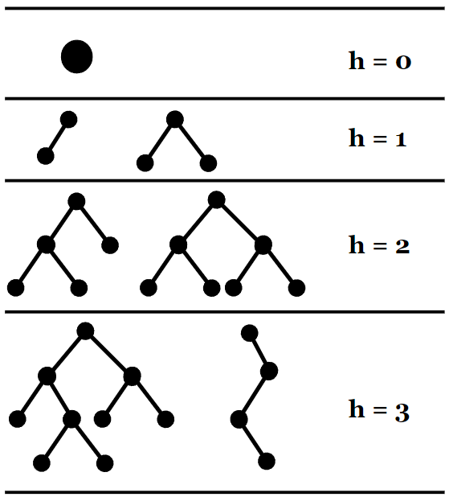
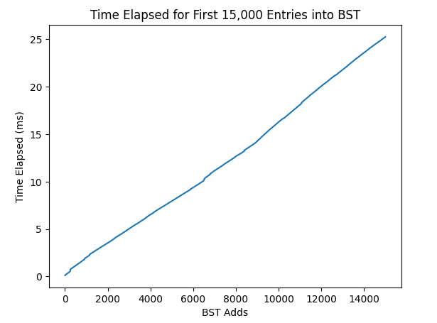
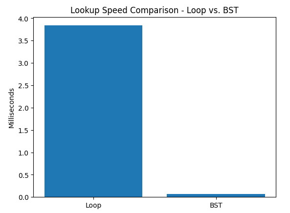
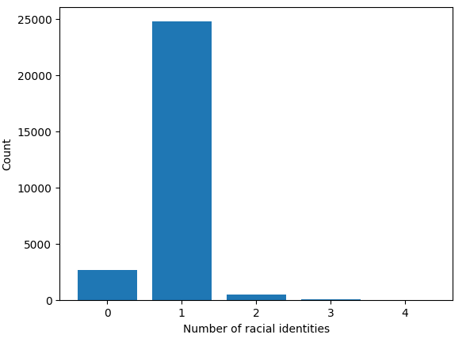

# Machine Project 3: Loan Analysis

## Corrections and Clarifications

* None yet

## Overview

Sadly, there is a long history of lending discrimination based on race
in the United States.  Lenders have literally drawn red
lines on a map around certain neighborhoods where they would not
offer loans, based on the racial demographics of those neighborhoods
(read more about redlining here: https://en.wikipedia.org/wiki/Redlining).
In 1975, congress passed the Home Mortgage Disclosure Act (HDMA) to
bring more transparency to this injustice
(https://en.wikipedia.org/wiki/Home_Mortgage_Disclosure_Act).  The
idea is that banks must report details about loan applications and
which loans they decided to approve.

The public HDMA dataset spans all the states and many years, and is documented here:
* https://www.ffiec.gov/hmda/pdf/2020guide.pdf
* https://cfpb.github.io/hmda-platform/#hmda-api-documentation

In this machine project, we'll analyze every loan application made in Wisconsin in
2020.

### Learning Objectives

There's a lot of new stuff here, and students have often reported back
that P3 is the hardest of the semester, so we encourage you to start
early.

During this machine project, students will:
- Practice with the Object-Oriented Programming (OOP) paradigm by creating custom classes for analyzing loan data.
- Work with analyzing large datasets.
- Create efficient data structures for data storage and lookup.
- Develop custom tests to ensure code quality.
- Write their own Python modules that can be used in other notebooks or scripts.

## Setup

Before you begin, follow the "starting a machine project" instructions in the [git-workflows](../git-workflows/README.md/#starting-a-machine-project) document to make sure that you are on the right branch and have the right files.

Since it is still early in the semester, we have provided the commands for you to run below:

```
git checkout main # Switch to the main branch
git pull # Pull the remote changes to your local branch
git checkout MP3 # Switch to the MP3 branch
git merge main # Merge the changes from main into MP3
```

Once you run these commands, you should verify that you are on the `MP3` branch by running `git branch`. Additionally, when you are in your git directory for this class, you should be able to run `ls` to see that this machine project and all of its files are present.

You are now ready to begin the machine project. Make sure that you add-commit-push your code as you go.

## Submission

**Required Files**
* `mp3.ipynb`: A notebook that should contain all of your answers to the machine project questions below.
* `loans.py`: A Python module (.py file) containing classes for creating `Applicant`, `Loan`, and `Bank` objects. (Will start in lab)
* `search.py`: A Python module (.py file) containing classes for creating `Node`, and `BST` objects. (Will start in lab)
* `module_tester.py`: A Python script (.py file) for testing the two modules we wrote above.

To submit the machine project, make sure that you have followed the instructions for "submitting a machine project"
in the [git-workflows](../git-workflows/README.md/#submitting-a-machine-project) document for the required file(s) above.

When following the submission instructions from above, the final output should look similar to this in GitLab:


**Note**: When we ran the autograder on this demonstration, we **did not** add in the additional tests. Make sure
that you add in the additional tests in `module_tester.py` to achieve full marks.

If you do not know how to get to this screen, review the link above. If you are having issues, please come to office hours.

### Important Notes:
1. Hardcoding of any kind or trying to "cheat" the autograder **will be penalized heavily and can also result in 0 marks for all the projects**. If you are confused about your code, please reach out to the teaching staff before submission.

# Group Part (75%)

For this portion of the machine project, you may collaborate with your group members in any way (including looking at group members' code). You may also seek help from CS 320 course staff (peer mentors, TAs, and the instructor). You **may not** seek or receive help from other CS 320 students (outside of your group) or anybody else outside of the course.

## Part 1: Loan Classes

For part 1 of this machine project, you will be working to create custom classes for handling data related to loans. These classes will allow us to easily take in large amounts of data and format it in a way that is easy for us to work with and analyze. 

To begin, finish the `Applicant` and `Loan` classes from [Lab 3](../labs/Lab3/README.md) (if you haven't already done so). These classes hold data about people who apply to loans and other data related to loans respectively.

We'll now add a `Bank` class to `loans.py` file that can keep track of some bank information as well as a list of `Loan` objects that are tied to this bank.  A `Bank` object can be created like this (create a class with the necessary constructor for this to work):

```python
lcu = loans.Bank("Landmark Credit Union")
```

### banks.json

The `__init__` of your `Bank` class should check that the given name appears in the `banks.json` file.  If it does, the `__init__` should also lookup the `lei` ("Legal Entity Identifier") corresponding to the name and store that in an `lei` attribute.  In other words, `lcu.lei` should give the LEI for LCU, in this case "254900CN1DD55MJDFH69".

**Note**: Try to avoid reading in the `banks.json` file each time you create a new `Bank` object. Instead, try defining it outside of the `Bank` class to optimize the creation of new `Bank` objects.

### wi.zip

The `__init__` should also iterate over the loan data from the CSV inside of `wi.zip` and either skip the loan data if the `lei` doesn't match that of the `Bank` object, or create a `Loan` object from the loan data if the `lei` does match and append it to a list that is stored as an attribute in the `Bank` object called `loan_list`. For example, someone should be able to call `lcu.loan_list` to get a list of all of the `Loan` objects that have the same `lei` as the `Bank` object we created above.

You already learned how to read text from a zip file in lab using `TextIOWrapper` and the `zipfile` module. Read the documentation and example for how to read CSV files with `DictReader` here: https://docs.python.org/3/library/csv.html#csv.DictReader.  You can combine this with what you learned about zipfiles.  When you create a `DictReader`, just pass in a `TextIOWrapper` object instead of a regular file object.

### Special Methods

Using this new `loan_list` attribute, you are able to print the last loan for this `Bank` object using:

```python
print(lcu.loan_list[-1])
```

And we can check how many loans there are associated with this `Bank` object using:

```python
print(len(lcu.loan_list))
```

For convenience, we want to be able to directly use brackets and `len` directly on `Bank` objects, like this:
* `lcu[-1]`
* `len(lcu)`

Add the special methods to `Bank` necessary to make the above two lines of code work.

## Testing

Running `python3 tester.py mp3.ipynb` does two things:

1. Compute a score based on whether answers in your `mp3.ipynb` are correct.
2. Get a second score by running `module_tester.py`, which exercises various classes/methods in `loan.py` (already done) and `search.py` (the next part)

Your total score is an average of these two components.

Try running `python3 module_tester.py` now.  You should see the following (assuming you haven't worked ahead on `search.py`):

```
{'score': 40.0, 'errors': ['could not find search module']}
```

It should actually be possible to get 50.0 from `module_tester.py`
after just completing `loans.py`, but we left some tests undone so you
can get practice writing tests for yourself.

Open `module_tester.py` and take a look at the `loans_test`.  The
function tries different things (e.g., creating different `Loan` and
`Applicant` objects and calling various methods).

Whenever something works, a global variable `loans_points` is
increased.  There are also asserts, and if any fail, the test stops
giving points.  For example, here's a bit that tests the `lower_age`
method:

```python
    # lower_age
    assert loans.Applicant("<25", []).lower_age() == 25
    assert loans.Applicant("20-30", []).lower_age() == 20
    assert loans.Applicant(">75", []).lower_age() == 75
    loans_points += 1
```

### Requirement: Additional tests in `module_tester.py`
You should add some additional test code of your choosing 
(based on where you think bugs are most likely to occur).  When the 
additional code shows that `loans.py` works correctly, it should add 4 
points to `loan_points`.  You could do this is one step (`loans_points += 4`),
or better, divide the points over the testing of a few different
aspects.

There are not any specific requirements for additional testing -- just make sure 
that you do add a new test (or more) and then give yourself more points.

### Debugging the Module Tester

If you are not currently passing the module tester, it is likely that you are failing one of the test cases which are created using `assert`. One common way of debugging these errors is by using print debugging. Here is an example of how print debugging might work for this machine project:

Let's say the following `assert` statement is failing:

```python
...
assert loans.Applicant("<25", []).lower_age() == 25
...
```

Adding a print statement above this line with `loans.Applicant("<25", []).lower_age()` will let us know the output of this code. So our code would now look something like this:

```python
...
print(loans.Applicant("<25", []).lower_age())
assert loans.Applicant("<25", []).lower_age() == 25
...
```

From here, we will be able to see what our code is outputting and can modify our code accordingly. For example, if we see that our code is printing `'25'`, we now know that our code is outputting a string instead of an int, and we can make the appropriate change in `loans.py` before rerunning the module tester.

## Part 2: Binary Search Tree

For part 2 of this machine project, you will be creating custom classes for a `Node` and `BST` data structures. These classes will allow us to lookup specific `Loan` objects efficiently as we will see in the questions below.

To begin, finish the `Node` and `BST` classes from [Lab 4](../labs/Lab4/README.md) (if you haven't already done so). 

**Note:** if we haven't gotten to BSTs in lecture and lab yet, you can still work on some of the questions in parts 3 and 4, but you should wait to work on the ones related to trees.

### Special Method

Add a special method to `BST` so that if `t` is a `BST` object so that it is possible to lookup items with `t["some key"]` instead of `t.root.lookup("some key")`.

## Part 3: 'Merchants Bank of Indiana' Analysis

For part 3 of this machine project, we will begin using the custom classes we created to do analysis on some banks, loans, and applicants. We will use our newly created `Bank`, `Loan`, and `Applicant` classes to do this analysis.

For the following questions, create a `Bank` object for the bank named "Merchants Bank of Indiana".

### Q1: What is the average interest rate for the bank?

Skip loans where the interest rate is not specified (`-1`) in your calculation.

### Q2: How many applicants are there per loan, on average?

### Q3: What is the distribution of ages?

Answer with a dictionary, like this:

```
{'65-74': 6, '<25': 2, ...}
```

Remember that the order of the keys does **not** matter, so if the tester is giving you 
errors, then you will need to double check that all of the values are correct.

### Requirement: `BST` of Loans for Q4 and Q5

For the following questions, create a `BST` tree.  Loop over every loan in the bank, adding each to the tree.  The `key` passed to the `add` call should be the `.interest_rate` of the `Loan` object, and the `val` passed to `add` should be the `Loan` object itself.

If we called our tree something like `mbi_tree` while creating it, we could now try running `mbi_tree.root.values`, and we can verify that we get two loans back:

```python
[<Loan: 3.875% on $135000.0 with 2 applicant(s)>,
 <Loan: 3.875% on $105000.0 with 2 applicant(s)>]
```

### Q4: How many interest rate values are missing?

Don't loop over every loan to answer.  Use your tree to get and count loans with missing rates (that is, `-1`).

### Q5: How tall is the tree?

The height is the number of edges in the path from the root to the deepest node. Write a recursive function or method to answer. This can be defined in your notebook or in your `search.py` module as either a standalone function, or as a method of the `BST` class.
**Height:**



# Individual Part (25%)

For this portion of the machine project, you are only allowed to seek help from CS 320 course staff (peer mentors, TAs, and the instructor). You **may not** receive help from anyone else.

For part 4 of this machine project, you will continue to do analysis using `Bank`, `Loan`, and `Appilcant` objects, only this time we will be using a bank
that has more data associated with it. Additionally, we will do some more benchmarking to see how our new data structures improve
lookups as well as some algorithms work to efficiently find desired statistics from our data.

## Part 4: 'Landmark Credit Union' Analysis

Build a new `Bank` and corresponding `BST` object as before, but now for "Landmark Credit Union".

### Q6: How long does it take to add the first 15,000 loans to the tree?

Answer with a plot, where the x-axis is how many loans have been added so far, and the y-axis is the total time that has passed so far.  You'll need to measure how much time has elapsed (since the beginning) after each `.add` call (until the first 15000 loans) using `time.time()`. Your code has to add all loans available for LCU to the tree and measure the time it takes only for the first 15000.

**Note:** Performance and the amount of noise will vary from one virtual machine to another, so your plot probably won't be identical (this applies to the other performance plots too). 



### Q7: How fast are tree lookups?

Create a bar plot with two bars:
1. time to find all `interest_rate` values equal to `1.99`, by looping over every loan and keeping a counter
2. time to compute `len(NAME_OF_YOUR_BST_OBJECT[1.99])`

*Note*: Both methods are calculating the same value: the amount of loans with an interest rate of 1.99. However, this value is not used anywhere in the graph, just the time that each method takes to find this value.



### Q8: What is the distribution of amount of racial identities across all applicants?

Answer with a bar graph. The x-axis should be the amount of racial identities
indicated by the applicant/co-applicant, while the y-axis should be the count
of applicants/co-applicants with the respective amount of racial identities.

It may be helpful to create a dictionary before you plot the values. If you do, the
corresponding values should be as follows:

```python
{0: 2639, 1: 24799, 2: 478, 3: 51, 4: 6}
```

**Note:** The x-axis should be the number of race identities selected by the applicants, not the individual races. (The height of the first bar represents how many applicants/co-applicants have 0 listed races)



### Q9: How many leaf nodes are in the tree?

Write a recursive function or method to count the number of leaf nodes present in the given BST.

### Q10: What is the third largest interest rate in the Bank BST?

Write a **recursive** function or method that can return the top 3 (or N) keys for any subtree.
