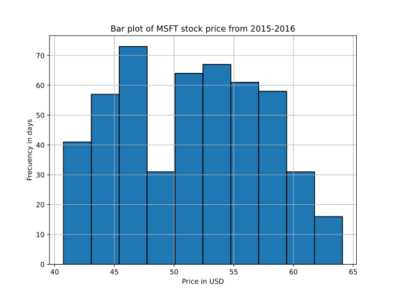
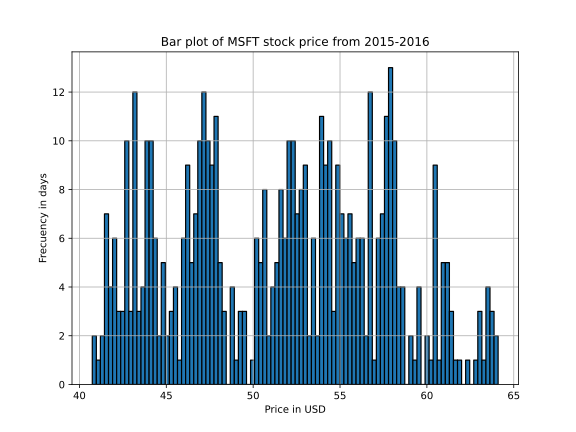
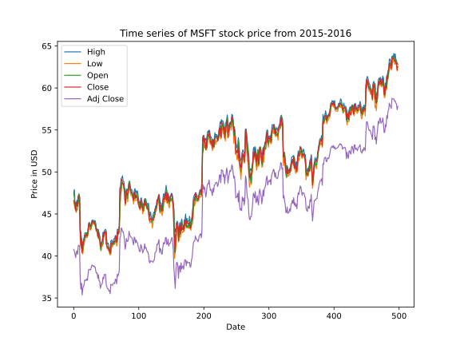

# Machine Project 5: Building a Data Website

## Corrections/Clarifications

* None yet

## Overview

In this machine project, you'll build a website that shares a dataset -- you
get to pick the dataset (possible data sources are listed below). Your
website will show the actual data on a standalone page, while the homepage
will showcase different visualizations of the data that you choose.

You'll use the flask framework for the website, which will have the
following features: 
1. **A page** within the website that displays the data in `JSON` format.
2. **A link** to a donation page that is optimized via A/B testing.
3. **A subscribe button** that only accepts valid email address formats.
4. **Multiple plots** on the homepage that gives an overview of the data.

More information on these requirements will be detailed below. 

Your `.py` file may be short, perhaps less than 100 lines, but it will probably
take a fair bit of time to get those lines right.

### Learning Objectives

During this machine project, students will:
- Build a web application for sharing data/information on the internet using
the Flask framework.
- Practice data visualization methods to create informative SVG plots relating
to a dataset that the student chooses.
- Create regular expressions for basic email validation.
- A/B test two different versions of a homepage to optimize donations.

## Setup

Before you begin, follow the "starting a machine project" instructions in the [git-workflows](../git-workflows/README.md/#starting-a-machine-project) document to make sure that you are on the right branch and have the right files.

For this machine project, we will need some additional modules. You can install them by running the
following line in your VM's command line:

```
pip3 install Flask lxml html5lib beautifulsoup4
```

## Testing

Run `python3 tester.py` inside of your `mp5` directory (your program must be named `main.py`) and work on fixing any issues.

## Submission

**Required Files**
* `main.py`: A Python module containing the code for your Flask web application.
* `main.csv`: A CSV file that contains the dataset you have chosen for this machine project. If the dataset initially has a different name, please rename it to `main.csv`, otherwise you will lose points when running the tester.
* `*.html`: All HTML files needed to run your website. For example, if you just have an `index.html` file, that would be all you need to submit. If you have an `index.html` file, a `donate.html` file, and more `.hmtl` files, you would need to commit all of them.
* `dashboard1.svg`: An SVG of your first data visualization.
* `dashboard1-query.svg`: An SVG of your first data visualization using a query string (i.e. this one should change with a query string and appear different from `dashboard1.svg`).
* `dashboard2.svg`: An SVG of your second data visualization.

To submit the machine project, make sure that you have followed the instructions for "submitting a machine project"
in the [git-workflows](../git-workflows/README.md/#submitting-a-machine-project) document for the required file(s) above.

When following the submission instructions from above, the final output should look similar to this in GitLab:


If you do not know how to get to this screen, review the link above. If you are having issues, please come to office hours.

**Important:** make sure your program is named `main.py` and your dataset is named `main.csv`.

### Important Notes:
1. Hardcoding of any kind or trying to "cheat" the autograder **will be penalized heavily and can also result in 0 marks for all the projects**. If you are confused about your code, please reach out to the teaching staff before submission.

# Group Part (80%)

For this portion of the machine project, you may collaborate with your group members in any way (including looking at group members' code). You may also seek help from CS 320 course staff (peer mentors, TAs, and the instructor). You **may not** seek or receive help from other CS 320 students (outside of your group) or anybody else outside of the course.

## Part 1: Data Selection

You get to choose the dataset for this machine project.  Find a CSV you like
somewhere, then download it as a file named `main.csv`.

The file should have between 10 and 1000 rows and between 3 and 15
columns.  Feel free to drop rows/columns from your original data
source if necessary. **You will lose points if the size of your data
is outside of these ranges.

**Mandatory**: leave a comment in your `main.py` about the source of
your data.

If you're looking for dataset ideas, here are a few places to look:
 - https://data-cityofmadison.opendata.arcgis.com
 - https://data.dhsgis.wi.gov/
 - https://www.kaggle.com/datasets
 - https://datasetsearch.research.google.com

## Part 2: Building a Web Application

For part 2 of the machine project, we will do the majority of the work for this
machine project in setting up the different pages that our web application will
have.

Your web application should include three pages:
1. `index.html`: The homepage for our project.
2. `browse.html`: A page where people can view the raw data we chose.
3. `donate.html`: A page where we will ask for donations for our project.

---

To get started, consider creating a basic `index.html` file for our homepage:

```html
<html>
  <body>
    <h1>Welcome!</h1>

    <p>Enjoy the data.</p>
  </body>
</html>
```

Then create a simple flask app in `main.py` with a route for the
homepage that loads `index.html`:

```python
import pandas as pd
from flask import Flask, request, jsonify

# TODO: Add a comment about your data source

app = Flask(__name__)
# df = pd.read_csv("main.csv")

@app.route('/')
def home():
    with open("index.html") as f:
        html = f.read()

    return html

if __name__ == '__main__':
    app.run(host="0.0.0.0", debug=True, threaded=False) # don't change this line!

# NOTE: app.run never returns (it runs for ever, unless you kill the process)
# Thus, don't define any functions after the app.run call, because it will
# never get that far.
```

After creating these files, try launching your application by running `python3 main.py`:
```
user@instance-1:~/cs320-projects-and-labs/mp5$ python3 main.py
 * Serving Flask app "main" (lazy loading)
 * Environment: production
   WARNING: This is a development server. Do not use it in a production deployment.
   Use a production WSGI server instead.
 * Debug mode: off
 * Running on http://0.0.0.0:5000/ (Press CTRL+C to quit)
```
This program runs indefinitely, until you kill it with `CTRL+C`
(meaning press `CTRL` and `C` at the same time).  Open your web
browser and go to `http://your-ip:5000` to see your page ("your-ip" is
the IP you use to SSH to your VM).

If something doesn't seem to be working correctly, there is a chance that you have a different program (maybe from MP5) running out of port 5000. To stop whatever is running in port 5000, you can run `lsof -i tcp:5000` in terminal. Then, find the process ID and run `kill ####`.

### Requirements for Pages

While there is quite a bit of creative freedom for this machine project and these
pages, we do have some requirements for what is on the pages.

- Going to `http://YOUR-VM-IP:port/browse.html` should return the content for `browse.html`, and similarly for the other pages.
- The index.html page should have hyperlinks to all the other pages. Be sure to not include your IP here! A relative path is necessary to pass our tests.
- You should put whatever content you think makes sense on the pages. Just make sure that they all start with an `<h1>` heading, giving the page a title.

### Requirement: `browse.html` page

The `browse.html` page should show an HTML table with all the data
from `main.csv`. Don't truncate the table on the page; we want to see
all the rows from `main.csv` on the screen (it is OK to delete rows in
`main.csv` if you want a shorter file, but make sure that this is done
outside of `main.py`). Don't have any other tables on
this page, so as not to confuse our tester.

The page might look something like this:

<!-- TODO: New image -->


**Hint 1:** you don't necessarily need to have an actual `browse.html`
**file** just because there's a `browse.html` **page**. 
The handler just needs to output a string in html format, 
meaning we can use python to build this string of html in many different ways.
For example, here's a `hi.html` page without a corresponding `hi.html` file:

```python
@app.route('/hi.html')
def hi_handler():
    return "howdy!"
```

For browsing, instead of returning a hardcoded string, you'll need to
generate a string containing HTML code for the table, then return that
string. For example, `"<html>{}<html>".format("hello")` would insert `"hello"`
into the middle of a string containing HTML code. 

**Hint 2:** look into `pandas.to_html()`. If you have floats in your table, make sure they are not truncated! By default, `to_html()` truncates floats, for example `1.286957141491255 -> 1.286957`.

### Requirement: `browse.json` page

What if other people want to easily download our dataset from our website?
They could use something like Selenium or `pandas.read_html()`, but that takes
extra effort on their part. Oftentimes, developers will provide access to
structured data over a network connection using JSON files. We will do the
same thing, and give other developers a place to go to download our data.

Add a resource at `https://your-ip:port/browse.json` that
displays the same information as `browse.html`, but in JSON format
(represent the DataFrame as a list of dicts, such that each dict
corresponds to one row).

#### Rate Limiting

Adding this resource for other developers was helpful, but what if someone wanted to
take down our web application? One way that they could try to do this is by 
repeatedly sending requests to our application, which may cause it to crash.

One way that we can try to fight this is with rate limiting, which will only allow a
user to access our data one time every minute.

Add rate limiting capabilities to the `browse.json` resource. If the specific user has not 
requested the data at this resource in the past 60 seconds, we will allow them to get the
data as normal. However, if they **have** requested the data at this resource in the past 60 seconds, we should return a `429` error code, as well as the proper `Retry-After` header.

Check the client IP with `request.remote_addr`.  Do not allow more
than one request per minute from any one IP address.

**Hint 1:** consider combining Flask's `jsonify` with Pandas `to_dict`: https://pandas.pydata.org/docs/reference/api/pandas.DataFrame.to_dict.html

**Hint 2:** we cover rate limiting in the future lecture.

### Requirement: `visitors.json`
Now add a resource at `http://your-ip:5000/visitors.json` that returns a list of the IP addresses that have visited your `browse.json` resource. We could think of this resource as a list of who has downloaded or viewed our `browse.json` resource.

**Hint 1:** use the client IPs stored in previous exercise (rate limiting). 

### Requirement: `donate.html` page

On your donations page, write some text, making your best plea for
funding. This can be as simple as adding a paragraph tag with a 
little information about why someone should donate to your project.

## Part 3: A/B Testing

Now that we have a donations page, we will want to optimize our web 
application's homepage so that it directs users to donate to our project
(without donations, a real web application may struggle to stay afloat due
to hosting fees and other costs).

We'll do an A/B test.  Create two versions of the **homepage**, say, A and B.
They should differ in some way, perhaps somewhat trivially (e.g., maybe the link
to donations is blue in version A and in red in version B), or in a more complicated
way. (**Note:** we *could* have two separate HTML files, but it might be easier to
utilize the `.replace(...)` method for strings to make this happen).

For the first 10 times your homepage is visited, alternate between version
A and B each time.  After that, pick the best version (the one where
people click to donate most often), and keep showing it for all future
visits to the page.

**Hint 1:** consider having a `global` counter in `main.py` to keep track of
how many times the homepage has been visited.  Consider whether this
number is 10 or less and whether it is even/odd when deciding between
showing version A or B for alternations.

**Hint 2:** when somebody visits `donate.html`, we need to know if
they took a link from version A or B of the homepage.  The easiest
way is using query strings. On version A of the homepage, instead of
having a regular link to `donate.html`, link to
"donate.html?from=A", and in the link on version B to `donate.html`,
use "donate.html?from=B".  Then the handler for the `donate.html`
route can keep count of how much people are using the links on both
versions of the home page. However, be sure to still allow for your
donate page to be accessible without a query string as well. For 
example, if someone were to just type YOUR-IP:5000/donate.html 
directly into their browser.
  
**Hint 3:** You don't necessarily need to have two different versions
of your homepage to make this work. You could use the templating
approach: once you read your `index.html` file into your program, you
can replace pieces of it. At that point it should be a string, so you could add
something to it or replace something in it.

## Part 4: Emails

There should be a **button** on your site that allows people to share
their email address with you to get updates about changes to the data:


When the button is clicked, some JavaScript code will run that does the following:
1. Pops up a box asking the user for their email address
2. Sends the email to your flask application
3. Depending on how your flask application responds, the JavaScript will either tell the user "thanks" or show an error message of your choosing

We'll give you the HTML+JavaScript parts, since this isn't a topic covered in class.

Add the following `<head>` code to your `index.html`, before the `<body>` code:

```html
  <head>
    <script src="https://code.jquery.com/jquery-3.4.1.js"></script>
    <script>
      function subscribe() {
        var email = prompt("What is your email?", "????");

        $.post({
          type: "POST",
          url: "email",
          data: email,
          contentType: "application/text; charset=utf-8",
          dataType: "json"
        }).done(function(data) {
          alert(data);
        }).fail(function(data) {
          alert("POST failed");
        });
      }
    </script>
  </head>
```

Then, in the main body of the HTML, add this code for the button somewhere:

```html
<button onclick="subscribe()">Subscribe</button>
```

Whenever the user clicks that button and submits an email, it will
POST the data to the `/email` route in your app, so add that to your
`main.py`:

```python
@app.route('/email', methods=["POST"])
def email():
    email = str(request.data, "utf-8")
    if len(re.findall(r"????", email)) > 0: # 1
        with open("emails.txt", "a") as f: # open file in append mode
            f.????(email + ????) # 2
        return jsonify(f"thanks, your subscriber number is {num_subscribed}!")
    return jsonify(????) # 3
```

Fill in the `????` parts in the above code so that it:
1. Use a regex expression that determines if the email is valid (**Hint**: For simplicity, a proper email address should follow the structure `abc@xyz.lmn`. `abc` and `xyz` can be any amount of letters or numbers, while `lmn` should be strictly a three letter string).
2. Writes each valid email address on its **own line** in `emails.txt`
3. Sternly warns the user who entered an invalid email address, by alerting to stop being so careless (you choose the wording)

Also find a way to fill the variable `num_subscribed` with the number
of users that have subscribed so far, including the user that just got
added.

**Note:** you can find information about `jsonify`
[here](https://flask.palletsprojects.com/en/2.2.x/api/#flask.json.jsonify).

# Individual Part (20%)

For this portion of the machine project, you are only allowed to seek help from CS 320 course staff (peer mentors, TAs, and the instructor). You **may not** receive help from anyone else.

## Dashboard

Implement a dashboard on your homepage showing at least 3 SVG images.
The SVG images must correspond to at least 2 different flask routes,
i.e., **one route must be used at least twice with different query
strings** (resulting in different plots).

### Important

* Ensure you are using the `Agg` backend for matplotlib, by explicitly setting
    
    ```python
    matplotlib.use('Agg')
    ```

    right after importing matplotlib.

* Ensure that `app.run` is launched with `threaded=False`.
    
* Further, use `fig, ax = plt.subplots()` to create the plots and close the plots after `savefig` with `plt.close(fig)` (otherwise you may run out of memory).

### Requirements

* All plots are based on the data chosen for `browse.html`, but you are free to choose what is plotted. 
Plots should have labels for both axes and optionally with a title.
* Similarly, there is no restriction on the choice of query string parameters, as long as the resulting plots are distinct.

**Hint 1:** having distinct plots assume that you **do not** reuse a significant portion of code that was used to create an earlier plot. Changing which columns should be placed for the x and y axes do not suffice.

**Hint 2:** you can check out many different types of plots. That is, other than scatter plots, you can utilize histograms or boxplots to capture the pattern/insight that your dataset contains ([see examples](https://matplotlib.org/stable/plot_types/index.html)). Take a careful look at your data and explore which types of plots you can work with.

E.g., We could have a dashboard with the following lines added to the
`index.html` file (you're encouraged to use more descriptive names for
your `.svg` routes).

```html
<br><br>
<br><br>
<br><br>
```

The dashboard SVGs may look something like this:

#### dashboard1.svg


#### dashboard1.svg?bins=100

Here, the query string uses `bins`, which in this case specifies the number of bins used to generate the barplot.



#### dashboard2.svg



When using query strings, ensure appropriate default values are supplied.

Finally, to help your TAs grade these plots, save the above plots locally as `dashboard1.svg`, `dashboard1-query.svg`, and `dashboard2.svg`, respectively.