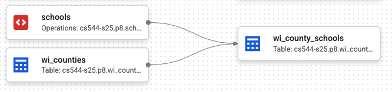

# P8: Google Cloud Services

## Overview

In this project, you'll be using four Google cloud services to analyze
a dataset describing all the schools in Wisconsin.  You'll write your
code in Jupyter, which will run on a cloud VM, and you'll upload your
data to a GCS bucket.  You'll use Dataform to create a pipeline that
brings this data (in combination with public geographic data) into a
BigQuery dataset.  Finally, you'll use BigQuery to answer questions
about data.

### Questions

The following questions will help you check that you created your VM correctly.

#### Q1: What is the OS release?

Write some Python code in a cell starting with `#q1` that reads `/etc/os-release` to a string that is used for the cell output (last line of the cell -- don't use print).

#### Q2: What CPUs does your VM have?

Use the `subprocess` module that comes with Python to programmatically run the `lscpu` program and capture the output in a string that you'll use for the output.

<!--
### Google cloud CLI (if applicable)

**Only** run this if `gcloud` is not a valid command on your VM (Debian/Ubuntu):

```shell
curl https://packages.cloud.google.com/apt/doc/apt-key.gpg | sudo gpg --dearmor -o /usr/share/keyrings/cloud.google.gpg
echo "deb [signed-by=/usr/share/keyrings/cloud.google.gpg] https://packages.cloud.google.com/apt cloud-sdk main" | sudo tee -a /etc/apt/sources.list.d/google-cloud-sdk.list
sudo apt-get update && sudo apt-get install google-cloud-cli
```

## Notebook

## Outputs

> **Important:**
>
> If the output of a cell answers question
> 3, start the cell with a comment: `#q3`. The autograder depends on
> this to correlate parts of your output with specific questions.

> **Important**:
>
> The autograder will extract your output from these cells, so it won't
> give points if not formatted correctly (extra spaces, split cells,
> etc.).
>
> For this project, answers are simple types (e.g., `int`s,
> `float`s, `dict`s), so you'll need to do a little extra work to get
> results out of the DataFrames you get from BigQuery.

-->

## Part 2: GCS Bucket

Navigate to [Google Cloud Storage WebUI](https://console.cloud.google.com/storage/).  Manually create a private GCS bucket. Bucket names must be globally unique, so you'll need to think of a name that nobody else in the world has already used.  For location, choose `Multi-region`, `us (multiple regions in the United States`).

Use pyarrow (https://arrow.apache.org/docs/python/generated/pyarrow.fs.GcsFileSystem.html) in your Jupyter notebook to connect to your bucket.  Read the bytes from the local `wi-schools-raw.parquet` file and use pyarrow to write it to a new GCS file in your bucket.

#### Q3: What are the paths of all the files/directories in the top-level of your bucket?

Answer with a Python list.

#### Q4: What is the modification time of wi-schools-raw.parquet, in nanoseconds?

## Part 3: Dataform

You'll use Dataform to create a pipeline that brings data from your GCS bucket into a BigQuery dataset.  Create a private BigQuery dataset named `p8` within your project.  You can decide to do this manually via the cloud console or programatically using a BigQuery client in your notebook.  The dataset should have "US" as the data location.

### Dataform Setup

Now, let's create a Dataform workspace:

1. Navigate to [BigQuery](https://console.cloud.google.com/bigquery)
2. Click `Dataform` in the menu on the left
3. Click `Create Repository`
4. Choose any "Repository ID" you like, and select "us-central1" for the "Region".
5. Click "Grant all" so that Dataform can run BigQuery queries
6. Navigate to the newly created repo. Click `Create Development Workspace`. Give it an ID and navigate to it.
7. Click `Initialize Workspace`
8. Navigate to the Workspace and edit the "workflow_settings.yaml" file.  `defaultLocation` should be "US", and `defaultDataset` should be "p8".

Your Dataform code will be run by a default *service account*; you can think of a service account as basically being a non-human user with some permissions.  Your service account will need some additional permissions:

1. go to IAM (https://console.cloud.google.com/iam-admin/iam) to update permissions
2. click "Include Google-provided role grants
3. click the edit icon by the "Dataform Service Account"
4. it may already have some roles, but add roles as necessary to make sure it has these four: `BigQuery Admin`, `BigQuery Job User`, `Dataform Service Agent`, and `Storage Object Viewer`

### Pipeline Code

Now, create 3 `.sqlx` files on your VM defining Dataform actions:
`wi_counties.sqlx`, `schools.sqlx`, and `wi_county_schools.sqlx`.

Your notebook should contain code that uses a
`dataform.DataformClient` to call `.write_file(...)` to upload each of
these to the workspace that you created manually.  Your code should
also call `create_compilation_result` to compile your sqlx files.

* **wi_counties.sqlx**: select from `bigquery-public-data.geo_us_boundaries.counties` to materialize a table of counties within Wisconsin (you can hardcode FIPS code of 55 for Wisconsin).
* **schools.sqlx**: use a `LOAD DATA OVERWRITE...` query to create a table `<YOUR_PROJECT>.p8.schools` from the `wi-schools-raw.parquet` file in your GCS bucket.  The config should specify `type: "operations"` and `hasOutput: true` because the SQL doesn't return results, so Dataform cannot infer these details.
* **wi_county_schools.sqlx**: this should geographically join schools to counties to produce a table with (a) all the columns of schools, (b) a `location` column which is an `ST_GEOGPOINT` based on coordinates of the school, and (c) a `county_name` column indicating the county in which the school is located.  This should use Dataform references to the other tables (`wi_counties` and `schools`), like `${ref('INPUT_TABLE')}`.

If you did the above correctly, the "Compiled graph" (which you can view for Dataform in the cloud console) should look like this:



### Questions

The following questions will help you check that you created your pipeline correctly.

#### Q5: How many counties are in Wisconsin?

Query your new `wi_counties` table to calculate the answer.  Do your query in your notebook, using either Jupyter magic (`%%bigquery`) or pure Python (`bq.query(...)` where `bq` is a `bigquery.Client`).

#### Q6: How many public schools are there in Wisconsin?

Use your `wi_county_schools` table.  Find schools where `agency_type` is "Public school".

<!-- (Expecting 2116) -->

#### Q7: What are the dependencies between all the Dataform tables?

Answer with a dictionary of lists, where each key is an action, and the value is a list of dependencies for that action.  It should look like the following (possibly with additional entries if you have created other actions for practice):

```
{'schools': [],
 'wi_counties': [],
 'wi_county_schools': ['schools', 'wi_counties'],
 ...
}
```

**Hint:** your previous `create_compilation_result` should have
  returned a response object from which you can extract a compilation
  name: `.name`.  You can use this to lookup details about the
  pipeline in the compilation results:

```python
response = df_client.query_compilation_result_actions(
    request={"name": compilation_result_name}
)
```

You can loop over `response.compilation_result_actions`.  Each `action` will have an `action.target.name` and `action.relation.dependency_targets`.

## Part 4: BigQuery

#### Q8: How many schools are there in each county?

Manipulate your query results to produce a dictionary of counts, like this:

```
{'Milwaukee': 420, 'Dane': 217, 'Waukesha': 177, 'Brown': 123,
 'Outagamie': 96, 'Rock': 72, 'Marathon': 72, 'Racine': 68,
 'Winnebago': 65, 'Sheboygan': 63, 'La Crosse': 59, 'Kenosha': 56,
 'Washington': 56, 'Walworth': 56, 'Fond du Lac': 55, 'Eau Claire':
 54, 'Jefferson': 52, 'Dodge': 51, 'Wood': 47, 'Manitowoc': 44,
 'Sauk': 42, 'Columbia': 41, 'Barron': 40, 'Grant': 39, 'Portage': 38,
 'Ozaukee': 38, 'Clark': 38, 'Waupaca': 36, 'St. Croix': 35,
 'Chippewa': 35, 'Calumet': 30, 'Shawano': 29, 'Pierce': 29,
 'Marinette': 29, 'Vernon': 29, 'Polk': 28, 'Monroe': 28,
 'Trempealeau': 27, 'Juneau': 26, 'Green': 23, 'Dunn': 22, 'Oconto':
 20, 'Lafayette': 18, 'Door': 18, 'Douglas': 18, 'Crawford': 17,
 'Oneida': 17, 'Iowa': 16, 'Lincoln': 16, 'Washburn': 16, 'Green
 Lake': 15, 'Kewaunee': 15, 'Richland': 14, 'Langlade': 13, 'Taylor':
 13, 'Vilas': 13, 'Sawyer': 13, 'Waushara': 13, 'Ashland': 12,
 'Bayfield': 12, 'Buffalo': 11, 'Rusk': 11, 'Marquette': 10,
 'Jackson': 10, 'Price': 9, 'Burnett': 9, 'Pepin': 7, 'Forest': 7,
 'Menominee': 4, 'Adams': 3, 'Florence': 3, 'Iron': 3}
```

#### Q9: How many times can you do a query like Q8 before exhausting the BigQuery free tier?

Round down to produce an int.

#### Q10: For each public middle school in Dane County, what is the geographically closest public high school in Dane County?

Answer with a dictionary, like this:

```
{'Badger Ridge Middle': 'Verona Area High', 'Badger Rock Middle':
'West High', 'Belleville Middle': 'Belleville High', 'Black Hawk
Middle': 'Shabazz-City High', 'Central Heights Middle': 'Prairie
Phoenix Academy', 'Cherokee Heights Middle': 'Capital High', 'De
Forest Middle': 'De Forest High', 'Deerfield Middle': 'Deerfield
High', 'Ezekiel Gillespie Middle School': 'Vel Phillips Memorial High
School', 'Glacial Drumlin School': 'LaFollette High', 'Glacier Creek
Middle': 'Middleton High', 'Hamilton Middle': 'Capital High', 'Indian
Mound Middle': 'McFarland High', 'Innovative and Alternative Middle':
'Innovative High', 'James Wright Middle': 'West High', 'Kromrey
Middle': 'Middleton High', 'Marshall Middle': 'Marshall High', 'Mount
Horeb Middle': 'Mount Horeb High', 'Nikolay Middle': 'Koshkonong
Trails School', "O'Keeffe Middle": 'Innovative High', 'Oregon Middle':
'Oregon High', 'Patrick Marsh Middle': 'Prairie Phoenix Academy',
'Prairie View Middle': 'Sun Prairie West High', 'River Bluff Middle':
'Stoughton High', 'Savanna Oaks Middle': 'Capital High', 'Sennett
Middle': 'LaFollette High', 'Sherman Middle': 'Shabazz-City High',
'Spring Harbor Middle': 'Capital High', 'Toki Middle': 'Vel Phillips
Memorial High School', 'Waunakee Middle': 'Waunakee High', 'Whitehorse
Middle': 'Monona Grove High', 'Wisconsin Heights Middle': 'Wisconsin
Heights High'}
```

